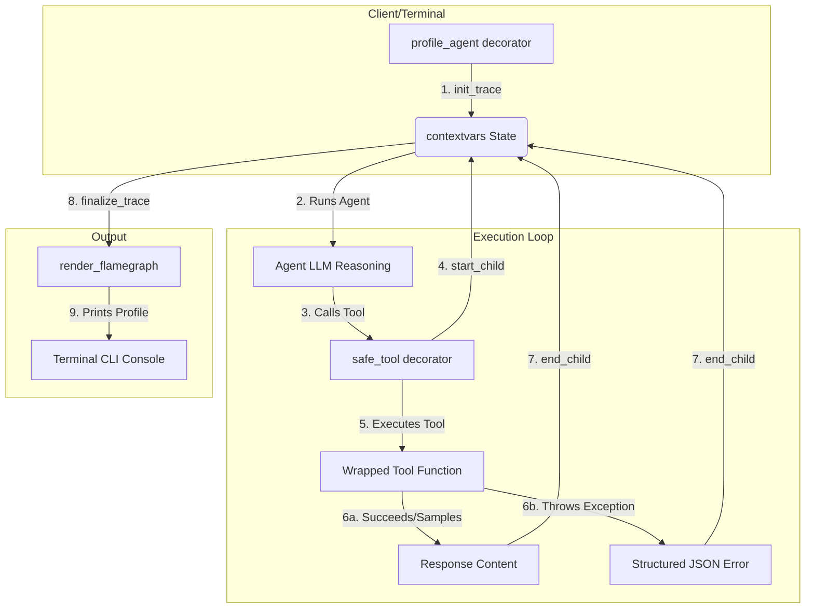

**Terminal-native agent resilience middleware for Python.**

AgentLatch is a zero-dependency framework that makes AI agents resilient and observable. It solves two massive pain points in agent development:

1. **Silent Tool Failures** — When an LLM executes a tool that crashes, AgentLatch intercepts the Python exception, prevents a runtime crash, and feeds a structured JSON error back to the LLM so it can self-correct.

2. **Blind Latency** — It tracks millisecond execution time of LLM vs. tools and prints a color-coded ASCII flamegraph directly in the terminal using the `rich` library. No API keys, no dashboards, no cloud.

## Quick Install

To install the core package:
```bash
pip install agentlatch
```

To install with **FastAPI/Starlette HTTP Middleware** support:
```bash
pip install "agentlatch[server]"
```

## Setup Virtual Environment

Before installing the package, it is recommended to create and activate a virtual environment to isolate your dependencies:

```bash
# Create a virtual environment
python -m venv .venv

# Activate it (macOS/Linux)
source .venv/bin/activate

# Activate it (Windows)
.venv\Scripts\activate
```

## Core Use Cases

AgentLatch is built to address critical requirements of production-ready AI agents:

* **Exception Interception & Self-Correction**: Raw tool crashes throw exceptions that break agent runs. `@safe_tool` translates these exceptions into structured JSON error prompts. The LLM parses the error feedback and corrects its parameters or query dynamically without failing.
* **Context Window Budgeting (Sampling)**: Large list returns or massive token blocks can overflow context windows. `@safe_tool(max_response_tokens=N, sample_rows=N)` automatically truncates response strings and lists, injecting metadata so the LLM is aware of the sampling.
* **Execution Timeline and Flamegraphs**: Track down slow operations (e.g. database lookups, external APIs). `@profile_agent` creates a visual breakdown of your tool durations vs. LLM reasoning directly in the CLI.
* **HTTP Endpoint Observability**: Debug agent execution flows during integration testing. `AgentLatchMiddleware` injects detailed trace logs directly into your Starlette/FastAPI headers and JSON response bodies for Postman or cURL debugging.

## Usage


### 1. Resilient Decorators
```python
from agentlatch import profile_agent, safe_tool

@safe_tool
def query_database(sql: str) -> str:
    """This tool is now protected — exceptions become JSON errors."""
    import sqlite3
    conn = sqlite3.connect("my.db")
    return str(conn.execute(sql).fetchall())

@safe_tool(timeout=5.0)
def call_api(url: str) -> str:
    """This tool has a 5-second cross-platform timeout."""
    import requests
    return requests.get(url).text

@profile_agent
def run_agent():
    """The agent loop — traced and visualized automatically."""
    result = query_database("SELECT * FROM users")
    weather = call_api("https://api.weather.com/sf")
    return f"Got {result} and {weather}"

run_agent()
```

### 2. Smart Response Sampling
Prevent large tool outputs from blowing up your LLM context window:
```python
# Limit response to ~2048 tokens and keep only first 10 list items/rows
@safe_tool(max_response_tokens=2048, sample_rows=10)
def fetch_large_dataset():
    # Returns 1,000 DB records. AgentLatch will slice to 10
    # and append sampling metadata: {"_agentlatch_sampled": true, "shown": 10, "total": 1000}
    ...
```

### 3. FastAPI / Starlette HTTP Middleware (Postman Visibility)
Get instant visibility into your agent execution flow directly in your API responses when testing via Postman or curl:
```python
from fastapi import FastAPI
from agentlatch.middleware import AgentLatchMiddleware

app = FastAPI()

# Adds timing headers and appends trace data to JSON responses
app.add_middleware(
    AgentLatchMiddleware,
    inject_profile=True,  # Appends "_agentlatch" to JSON response body
    trace_name="MyChatAgent"
)
```

## What Happens

1. **Execution**: Every `@safe_tool` call is timed, protected, and sampled.
2. **On Error**: Instead of crashing, the tool returns a JSON error string:
   ```json
   {
     "status": "error",
     "error_type": "ProgrammingError",
     "message": "column 'age' does not exist",
     "instruction": "The tool execution failed. Review your parameters and retry with corrected inputs."
   }
   ```
3. **On Completion (CLI)**: A rich flamegraph is printed to the terminal in development mode.
4. **On Completion (HTTP / Postman)**:
   * **Headers tab**:
     ```
     X-AgentLatch-Version: 0.1.0
     X-AgentLatch-Duration-Ms: 1234
     X-AgentLatch-Tools-Ms: 850
     X-AgentLatch-Errors: 1
     ```
   * **Response Body**:
     ```json
     {
       "response": "Based on the database...",
       "_agentlatch": {
         "version": "0.1.0",
         "trace_id": "abc-123",
         "total_ms": 1234,
         "tool_ms": 850,
         "llm_reasoning_ms": 384,
         "tools": [
           {"name": "query_database", "duration_ms": 305, "status": "success"}
         ],
         "errors_count": 0
       }
     }
     ```

## Features

| Feature | Description |
|---------|-------------|
| `@safe_tool` | Wraps any function — catches exceptions, returns JSON errors |
| `@safe_tool(timeout=N)` | Adds a thread-based timeout (cross-platform) |
| `@safe_tool(sample_rows=N)` | Automatically slices massive JSON list outputs to first N items |
| `@safe_tool(max_response_tokens=N)` | Truncates tool string responses if they exceed approximate token budget |
| `@profile_agent` | Traces the full agent loop and renders the flamegraph |
| `AgentLatchMiddleware` | Starlette/FastAPI middleware for Postman & curl trace observability |
| Async support | Both decorators work with `async def` functions |
| Dev Mode Guard | Automatically suppresses ASCII visuals in production (`AGENTLATCH_ENV=production`) |
| Framework agnostic | Works with LangGraph, AutoGen, CrewAI, or vanilla scripts |

## Running Examples

```bash
# Vanilla agent with a forced failure + self-correction
python examples/vanilla_agent.py

# LangGraph-style state machine
python examples/langgraph_agent.py

# FastAPI + LangGraph + Groq Agent (requires GROQ_API_KEY)
export GROQ_API_KEY="your-groq-key"
uvicorn examples.fastapi_agent:app --reload
```

## Running Tests

```bash
uv pip install -e ".[server]"
pytest tests/ -v
```

## Development Plans

All detailed design documents and implementation plans for the development phases are included directly in the package under the `agentlatch.plans` subpackage (located inside the [agentlatch/plans/](file:///Users/aravsaxena/Downloads/dao/AgentLatch/agentlatch/plans) directory).

## Architecture



- **`contextvars`** — Thread-safe trace propagation without manual trace IDs
- **`concurrent.futures`** — Cross-platform timeouts (no `signal.alarm`)
- **`rich`** — Premium terminal rendering
- **`starlette`** — Lightweight core HTTP middleware support

## License

MIT

