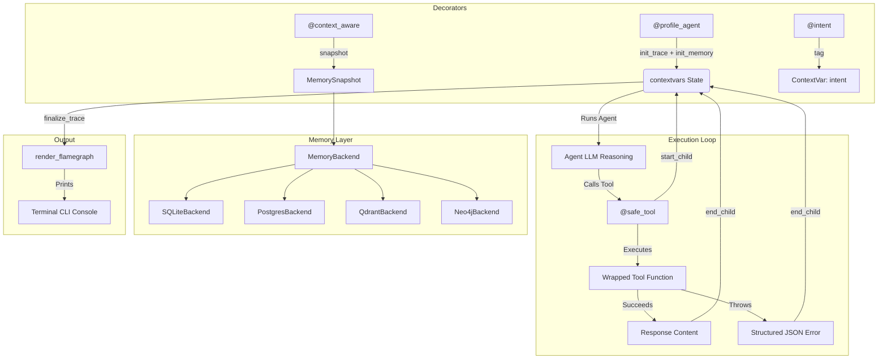
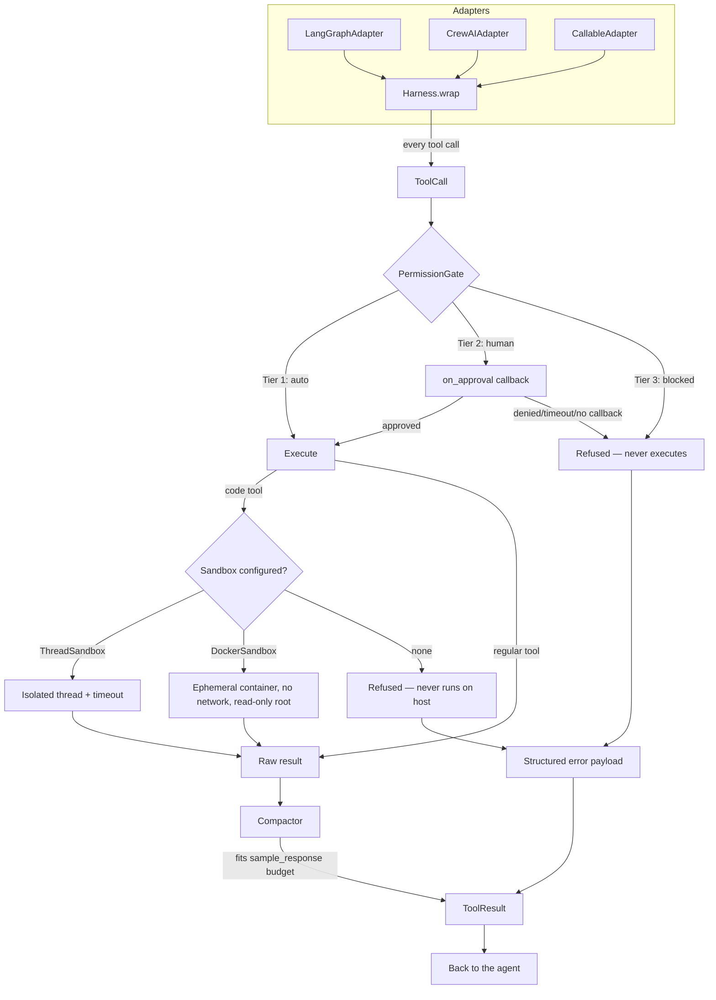

**Terminal-native agent resilience middleware for Python.**

AgentLatch is a zero-dependency framework that makes agents resilient, observable, and memory-aware. It solves three massive pain points in agent development:

1. **Silent Tool Failures** — When an LLM executes a tool that crashes, AgentLatch intercepts the Python exception, prevents a runtime crash, and feeds a structured JSON error back to the LLM so it can self-correct.

2. **Blind Latency** — It tracks millisecond execution time of LLM vs. tools and prints a color-coded ASCII flamegraph directly in the terminal using the `rich` library. No API keys, no dashboards, no cloud.

3. **Context Rot in Multi-Agent Workflows** — In long-running DAG pipelines, LLMs forget key information and repeat mistakes. `@context_aware` creates structured memory snapshots with delta updates, progressive disclosure, and intent tagging so sub-agents can query upstream results without re-executing.

4. **No Execution Boundary** — Orchestration frameworks (LangGraph, CrewAI, AutoGen) decide what an agent does next, but none of them decide what it is *allowed* to do or where its code actually runs. The **AgentLatch Harness** (`agentlatch.harness`) adds a permission-gated, sandboxed execution layer around any framework in one line: `harness.wrap(LangGraphAdapter(my_graph))`.

## Quick Install

To install the core package:
```bash
pip install agentlatch
```

To install with **FastAPI/Starlette HTTP Middleware** support:
```bash
pip install "agentlatch[server]"
```

To install with **vector memory backends**:
```bash
pip install "agentlatch[vector]"    # PostgreSQL + pgvector
pip install "agentlatch[qdrant]"     # Qdrant
pip install "agentlatch[graph]"      # Neo4j
pip install "agentlatch[all-memory]" # All backends
```

To install with **Harness sandboxed code execution** (Docker):
```bash
pip install "agentlatch[sandbox]"    # adds docker>=6.0 for DockerSandbox
```
`ThreadSandbox` needs nothing extra — only `DockerSandbox` requires this extra, and the harness core (permissions, adapters, compaction) has no dependency beyond `rich` either way.

## Setup Virtual Environment

Before installing the package, it is recommended to create and activate a virtual environment to isolate your dependencies:

```bash
# Create a virtual environment
python -m venv .venv

# Activate it (macOS/Linux)
source .venv/bin/activate

# Activate it (Windows)
.venv\Scripts\activate
```

## Core Use Cases

AgentLatch is built to address critical requirements of production-ready AI agents:

* **Exception Interception & Self-Correction**: Raw tool crashes throw exceptions that break agent runs. `@safe_tool` translates these exceptions into structured JSON error prompts. The LLM parses the error feedback and corrects its parameters or query dynamically without failing.
* **Context Window Budgeting (Sampling)**: Large list returns or massive token blocks can overflow context windows. `@safe_tool(max_response_tokens=N, sample_rows=N)` automatically truncates response strings and lists, injecting metadata so the LLM is aware of the sampling.
* **Execution Timeline and Flamegraphs**: Track down slow operations (e.g. database lookups, external APIs). `@profile_agent` creates a visual breakdown of your tool durations vs. LLM reasoning directly in the CLI.
* **HTTP Endpoint Observability**: Debug agent execution flows during integration testing. `AgentLatchMiddleware` injects detailed trace logs directly into your Starlette/FastAPI headers and JSON response bodies for Postman or cURL debugging.
* **Structured Memory for Multi-Agent DAGs**: `@context_aware` creates memory snapshots after tool calls with intent tagging, delta updates, and progressive disclosure. Sub-agents in a DAG can query upstream results without re-executing expensive operations.
* **Tiered Tool Permissions**: `Harness` classifies every tool call into Tier 1 (auto-approved, read-only), Tier 2 (human-in-the-loop, state-changing), or Tier 3 (permanently blocked, destructive). Unrecognized tools default to asking a human, never to running silently.
* **Sandboxed Code Execution**: Agent-authored Python or shell code never runs on the host. `ThreadSandbox` gives timeout containment for trusted code; `DockerSandbox` runs it in an ephemeral, network-isolated container with a read-only root filesystem.
* **Progressive Tool Disclosure**: `ToolRegistry` loads only tool name + one-line summary into the system prompt, and exposes a `get_tool_schema` tool the agent calls to fetch a full schema on demand — cutting prompt tokens for large tool catalogs.

## Usage


### 1. Resilient Decorators
```python
from agentlatch import profile_agent, safe_tool


@safe_tool
def query_database(sql: str) -> str:
    """This tool is now protected — exceptions become JSON errors."""
    import sqlite3

    conn = sqlite3.connect("my.db")
    return str(conn.execute(sql).fetchall())


@safe_tool(timeout=5.0)
def call_api(url: str) -> str:
    """This tool has a 5-second cross-platform timeout."""
    import requests

    return requests.get(url).text


@profile_agent
def run_agent():
    """The agent loop — traced and visualized automatically."""
    result = query_database("SELECT * FROM users")
    weather = call_api("https://api.weather.com/sf")
    return f"Got {result} and {weather}"


run_agent()
```

### 2. Smart Response Sampling
Prevent large tool outputs from blowing up your LLM context window:
```python
# Limit response to ~2048 tokens and keep only first 10 list items/rows
@safe_tool(max_response_tokens=2048, sample_rows=10)
def fetch_large_dataset():
    # Returns 1,000 DB records. AgentLatch will slice to 10
    # and append sampling metadata: {"_agentlatch_sampled": true, "shown": 10, "total": 1000}
    ...
```

### 3. FastAPI / Starlette HTTP Middleware (Postman Visibility)
Get instant visibility into your agent execution flow directly in your API responses when testing via Postman or curl:
```python
from fastapi import FastAPI
from agentlatch.middleware import AgentLatchMiddleware

app = FastAPI()

# Adds timing headers and appends trace data to JSON responses
app.add_middleware(
    AgentLatchMiddleware,
    inject_profile=True,  # Appends "_agentlatch" to JSON response body
    trace_name="MyChatAgent",
)
```

### 4. The Harness — Universal Execution Layer

The harness sits between your agent framework and the operating system. Every tool call flows through one pipeline regardless of what produced it:

```
ToolCall -> PermissionGate -> [Sandbox] -> Compactor -> ToolResult
```

Nothing in this pipeline raises outward — a blocked call, a denied approval, a crashed tool, and a timed-out container all come back as structured data the LLM can read and correct from, same as `@safe_tool`.

```python
from agentlatch.harness import Harness, ThreadSandbox, cli_approval_callback
from agentlatch.harness.adapters import CallableAdapter


def read_config(path: str) -> str:
    """Tier 1 — read-only, auto-approved by the default policy."""
    return f"contents of {path}"


def delete_user(user_id: int) -> str:
    """Tier 2 — mutates state, so a human is asked before it runs."""
    return f"deleted user {user_id}"


harness = Harness(
    sandbox=ThreadSandbox(),  # or DockerSandbox() for real isolation
    on_approval=cli_approval_callback,  # prompts on stdin for Tier 2 calls
)

tools = harness.wrap(
    CallableAdapter(
        {
            "read_config": read_config,
            "delete_user": delete_user,
        }
    )
)

tools["read_config"]("/etc/app.conf")  # runs immediately
tools["delete_user"](user_id=42)  # pauses for approval first

# Sandbox agent-authored code directly — never on the host:
result = harness.execute_code("print(sum(range(10)))")
print(result.stdout)  # "45"

print(harness.audit_log)  # every decision, structured
```

One-liner for the common case — auto-detects the framework from the object's shape:

```python
from agentlatch.harness import secure

secured_graph, harness = secure(my_compiled_langgraph, sandbox=ThreadSandbox())
secured_graph.invoke({"messages": [...]})
```

**Adapters** attach the harness to a framework without the harness knowing anything about it:

```python
from agentlatch.harness.adapters import LangGraphAdapter, CrewAIAdapter

secured_graph = harness.wrap(
    LangGraphAdapter(my_compiled_graph)
)  # still .invoke()-able
secured_crew = harness.wrap(CrewAIAdapter(my_crew))  # still .kickoff()-able
```

**Permission policy** is fully customizable — rules match by tool-name glob or by regex against the flattened call, and the most restrictive match always wins:

```python
from agentlatch.harness import PermissionPolicy, Rule, PermissionTier

policy = (
    PermissionPolicy.default()
)  # Tier 1 read_*/get_*/list_*, Tier 2 write_*/delete_*, Tier 3 rm -rf etc.
policy.add_rule(
    Rule(
        name="block_prod_migrations",
        tools=["run_migration"],
        tier=PermissionTier.BLOCKED,
        reason="Production migrations must go through the release pipeline, not an agent.",
    )
)

harness = Harness(policy=policy)
```

**Sandboxed code execution** — `DockerSandbox` runs agent-authored code in an ephemeral container: no network by default, dropped capabilities, read-only root filesystem, and only the environment variables you explicitly pass through (the host's environment, including its API keys, is never inherited):

```python
from agentlatch.harness import DockerSandbox, ExecutionRequest, Language

with (
    DockerSandbox() as box
):  # auto-discovers Docker Desktop, colima, or Rancher's socket
    result = box.run(
        ExecutionRequest(
            code="print('hello from an isolated container')",
            language=Language.PYTHON,
            timeout=10.0,
        )
    )
    print(result.stdout, result.exit_code)
```

**Context compaction and progressive disclosure** keep large tool catalogs and large tool outputs from blowing up the context window:

```python
from agentlatch.harness import Compactor, ToolRegistry

compactor = Compactor(max_tokens=2048, sample_rows=50)
result = compactor.compact(huge_dict_from_a_database_tool)
print(result.compacted, result.final_tokens)

registry = harness.registry  # auto-populated by harness.wrap() from adapter.discover()
print(registry.system_prompt_block())  # names + one-line summaries only
schema = registry.disclose("read_config")  # full schema, fetched on demand
```

Run the end-to-end demo (no agent framework required):
```bash
python examples/harness_agent.py            # ThreadSandbox
python examples/harness_agent.py --docker    # real container isolation
```

## What Happens

1. **Execution**: Every `@safe_tool` call is timed, protected, and sampled.
2. **On Error**: Instead of crashing, the tool returns a JSON error string:
   ```json
   {
     "status": "error",
     "error_type": "ProgrammingError",
     "message": "column 'age' does not exist",
     "instruction": "The tool execution failed. Review your parameters and retry with corrected inputs."
   }
   ```
3. **On Completion (CLI)**: A rich flamegraph is printed to the terminal in development mode.
4. **On Completion (HTTP / Postman)**:
   * **Headers tab**:
     ```
     X-AgentLatch-Version: 0.1.0
     X-AgentLatch-Duration-Ms: 1234
     X-AgentLatch-Tools-Ms: 850
     X-AgentLatch-Errors: 1
     ```
   * **Response Body**:
     ```json
     {
       "response": "Based on the database...",
       "_agentlatch": {
         "version": "0.1.0",
         "trace_id": "abc-123",
         "total_ms": 1234,
         "tool_ms": 850,
         "llm_reasoning_ms": 384,
         "tools": [
           {"name": "query_database", "duration_ms": 305, "status": "success"}
         ],
         "errors_count": 0
       }
     }
     ```

## Features

| Feature | Description |
|---------|-------------|
| `@safe_tool` | Wraps any function — catches exceptions, returns JSON errors |
| `@safe_tool(timeout=N)` | Adds a thread-based timeout (cross-platform) |
| `@safe_tool(sample_rows=N)` | Automatically slices massive JSON list outputs to first N items |
| `@safe_tool(max_response_tokens=N)` | Truncates tool string responses if they exceed approximate token budget |
| `@context_aware` | Creates structured memory snapshots after each successful tool call |
| `@context_aware(delta=True)` | Stores only the diff from the last output — reduces storage and token cost |
| `@context_aware(progressive=True)` | Returns a lightweight reference; full data stored in memory |
| `@intent("tag")` | Tags tool calls with intent labels for cross-node memory retrieval |
| `@profile_agent` | Traces the full agent loop, initializes memory, renders the flamegraph |
| `AgentLatchMiddleware` | Starlette/FastAPI middleware for Postman & curl trace observability |
| Pluggable Memory Backends | SQLite (default), PostgreSQL+pgvector, Qdrant, Neo4j |
| Async support | All decorators work with `async def` functions |
| Dev Mode Guard | Automatically suppresses ASCII visuals in production (`AGENTLATCH_ENV=production`) |
| Framework agnostic | Works with LangGraph, AutoGen, CrewAI, or vanilla scripts |
| `Harness` | Universal execution layer: permission gate, sandbox, and compaction around any framework |
| `PermissionPolicy` / `PermissionGate` | Tiered auto-approve / human-in-the-loop / block-outright rules for tool calls |
| `ThreadSandbox` / `DockerSandbox` | Run agent-authored code off the host — thread-timeout or ephemeral network-isolated container |
| `ToolRegistry` | Progressive tool disclosure — summaries in the prompt, full schemas fetched on demand |
| `LangGraphAdapter` / `CrewAIAdapter` / `CallableAdapter` | Attach the harness to a framework in one line, no framework-specific code required |

## Memory System

### Basic Usage
```python
from agentlatch import context_aware, intent, safe_tool, profile_agent


@intent("database_query")
@context_aware(delta=True)
@safe_tool
def query_db(sql: str) -> str:
    """Memory-aware tool with delta tracking."""
    import sqlite3

    conn = sqlite3.connect("my.db")
    return str(conn.execute(sql).fetchall())


@profile_agent  # Auto-initializes SQLite memory
def run_agent():
    # First call: stores full snapshot in memory.
    result = query_db("SELECT * FROM users")
    # Second call: stores only the delta (changed rows).
    result = query_db("SELECT * FROM users WHERE active=1")
    return result
```

### Official LangGraph StateGraph Integration
```python
from typing import TypedDict
from langgraph.graph import StateGraph, START, END
from agentlatch import context_aware, intent, safe_tool, profile_agent, get_memory


# 1. Define State
class AgentState(TypedDict):
    query: str
    documents: list[str]
    analysis: str


# 2. Define Traced & Memory-Aware Nodes
@intent("retrieval")
@context_aware
@safe_tool
def retrieve_node(state: AgentState) -> dict:
    return {"documents": ["Doc 1", "Doc 2"]}


@intent("analysis")
@context_aware(delta=True)
@safe_tool
def analyze_node(state: AgentState) -> dict:
    memory = get_memory()
    # Query upstream memory recorded during "retrieval" node
    upstream_docs = memory.query(intent="retrieval") if memory else []
    return {
        "analysis": f"Analyzed {len(state['documents'])} docs (upstream hits: {len(upstream_docs)})"
    }


# 3. Build Graph
workflow = StateGraph(AgentState)
workflow.add_node("retrieve", retrieve_node)
workflow.add_node("analyze", analyze_node)
workflow.add_edge(START, "retrieve")
workflow.add_edge("retrieve", "analyze")
workflow.add_edge("analyze", END)
pipeline = workflow.compile()


# 4. Traced Execution
@profile_agent(name="LangGraphAgent")
def run_langgraph():
    return pipeline.invoke(
        {
            "query": "LangGraph + AgentLatch",
            "documents": [],
            "analysis": "",
        }
    )
```

### Multi-Agent DAG (Leader / Sub-Agent)
```python
from agentlatch import context_aware, intent, safe_tool, profile_agent, SQLiteBackend
from agentlatch.memory.context import get_memory, set_agent_id, set_node_context


# --- Sub-Agent Tools ---
@intent("research")
@context_aware
@safe_tool
def search_docs(query: str) -> str:
    return '{"results": ["doc1", "doc2"]}'


@intent("analyze")
@context_aware(delta=True)
@safe_tool
def analyze(data: str) -> str:
    return '{"insight": "growth is 12%"}'


# --- Leader Agent ---
@profile_agent(name="LeaderAgent", memory_backend=SQLiteBackend(".agent.db"))
def run_pipeline():
    # Phase 1: Research node
    set_node_context("research_node")
    set_agent_id("researcher")
    docs = search_docs("AI agents")

    # Phase 2: Analysis node (can query upstream memory)
    set_node_context("analysis_node")
    set_agent_id("analyst")
    memory = get_memory()
    research = memory.query(intent="research", limit=5)  # Cross-node query!
    result = analyze(str(research))
    return result
```

### Custom Memory Backend
```python
from agentlatch import profile_agent, SQLiteBackend


# Persistent file-based memory
@profile_agent(memory_backend=SQLiteBackend(".agentlatch.db"))
def persistent_agent(): ...


# Disable memory entirely
@profile_agent(enable_memory=False)
def no_memory_agent(): ...
```

## Running Examples

```bash
# Vanilla agent with a forced failure + self-correction
python examples/vanilla_agent.py

# LangGraph StateGraph pipeline
python examples/langgraph_agent.py

# Multi-agent DAG with memory (leader + sub-agents)
python examples/memory_langgraph_agent.py

# Enterprise Complex Multi-Agent DAG (Parallel branches, conditional router, self-correction)
python examples/complex_multiagent_dag.py

# Real ChatGroq + LangGraph Agent (requires GROQ_API_KEY)
export GROQ_API_KEY="your-groq-key"
python examples/groq_langgraph_agent.py

# ChatGroq + Tavily Multi-Agent Customer Support Bot (requires GROQ_API_KEY & TAVILY_API_KEY)
export GROQ_API_KEY="your-groq-key"
export TAVILY_API_KEY="your-tavily-key"
python examples/groq_customer_support_bot.py
# (Type 'exit' or press Enter to end session & render the flamegraph report!)

# FastAPI + LangGraph + Groq Agent (requires GROQ_API_KEY)
export GROQ_API_KEY="your-groq-key"
uvicorn examples.fastapi_agent:app --reload

# Harness — permissions, sandboxing, and compaction, no framework required
python examples/harness_agent.py
python examples/harness_agent.py --docker  # requires `pip install agentlatch[sandbox]` + a running daemon
```

## Running Tests

```bash
uv pip install -e ".[server]"
pytest tests/ -v
```

## Development Plans

All detailed design documents and implementation plans for the development phases are included directly in the package under the `agentlatch.plans` subpackage (located inside the [agentlatch/plans/](file:///Users/aravsaxena/Downloads/dao/AgentLatch/agentlatch/plans) directory).

## Architecture


```mermaid
graph TD
    subgraph Decorators
        PA["@profile_agent"] -->|init_trace + init_memory| B(contextvars State)
        CA["@context_aware"] -->|snapshot| MS[MemorySnapshot]
        IN["@intent"] -->|tag| CV[ContextVar: intent]
    end

    subgraph Execution Loop
        B -->|Runs Agent| C[Agent LLM Reasoning]
        C -->|Calls Tool| D["@safe_tool"]
        D -->|start_child| B
        D -->|Executes| E[Wrapped Tool Function]
        E -->|Succeeds| F[Response Content]
        E -->|Throws| G[Structured JSON Error]
        F -->|end_child| B
        G -->|end_child| B
    end

    subgraph Memory Layer
        MS --> MB[MemoryBackend]
        MB --> SQ[SQLiteBackend]
        MB --> PG[PostgresBackend]
        MB --> QD[QdrantBackend]
        MB --> N4[Neo4jBackend]
    end

    subgraph Output
        B -->|finalize_trace| H[render_flamegraph]
        H -->|Prints| I[Terminal CLI Console]
    end
```

### Harness Architecture

The harness is a second, independent layer built on the same foundations — it governs tool calls owned by an *agent framework*, where the decorators above protect tools *you* write.


```mermaid
graph TD
    subgraph Adapters
        LG[LangGraphAdapter] --> WRAP[Harness.wrap]
        CA[CrewAIAdapter] --> WRAP
        GA[CallableAdapter] --> WRAP
    end

    WRAP -->|every tool call| TC[ToolCall]
    TC --> PG{PermissionGate}
    PG -->|Tier 1: auto| EXEC[Execute]
    PG -->|Tier 2: human| APPROVE[on_approval callback]
    PG -->|Tier 3: blocked| DENY[Refused — never executes]
    APPROVE -->|approved| EXEC
    APPROVE -->|denied/timeout/no callback| DENY

    EXEC -->|code tool| SBOX{Sandbox configured?}
    SBOX -->|ThreadSandbox| THR[Isolated thread + timeout]
    SBOX -->|DockerSandbox| DKR[Ephemeral container, no network, read-only root]
    SBOX -->|none| REFUSE[Refused — never runs on host]

    EXEC -->|regular tool| RESULT[Raw result]
    THR --> RESULT
    DKR --> RESULT

    RESULT --> COMPACT[Compactor]
    COMPACT -->|fits sample_response budget| OK[ToolResult]
    DENY --> ERR[Structured error payload]
    REFUSE --> ERR
    ERR --> OK
    OK --> LLM[Back to the agent]
```

- **`contextvars`** — Thread-safe trace and memory propagation without manual IDs
- **`concurrent.futures`** — Cross-platform timeouts (no `signal.alarm`)
- **`sqlite3`** — Zero-dependency default memory backend
- **`rich`** — Premium terminal rendering
- **`starlette`** — Lightweight core HTTP middleware support
- **`docker`** *(optional, `[sandbox]` extra)* — Ephemeral, network-isolated code execution via `DockerSandbox`

## License
Apache 2.0
