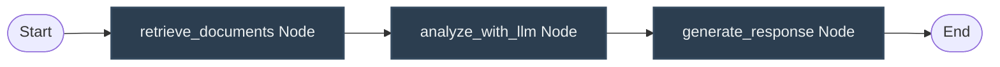

# AgentLatch Examples & Workflows

This directory contains functional examples of how to integrate AgentLatch into different Python AI agent architectures. It covers raw/vanilla agents, state-machine graphs (e.g. LangGraph), and HTTP middleware endpoints (e.g. FastAPI/Starlette) with LangChain tools.

---

## 1. Vanilla Python Agent Flow

* **File**: [`vanilla_agent.py`](vanilla_agent.py)
* **Description**: Simulates a standard iterative agent reasoning loop. The agent calls a database query tool that deliberately fails on its first attempt, allowing the agent to self-correct and execute a successful retry.
* **Key Features Demonstrated**:
  * `@profile_agent` tracking the main loop and printing the terminal flamegraph.
  * `@safe_tool` catching database Exceptions and converting them to structured JSON.
  * `@safe_tool(timeout=5.0)` wrapping a simulated weather API query.

```bash
# Execute the vanilla agent example
python examples/vanilla_agent.py
```

---

## 2. State-Machine / Graph Workflow (LangGraph Style)

* **File**: [`langgraph_agent.py`](langgraph_agent.py)
* **Description**: Simulates a graph execution loop similar to LangGraph, where each node in the graph represents a distinct operation (retrieval, analysis, generation) passed along an `AgentState` context.
* **Key Features Demonstrated**:
  * Wrapping node methods directly with `@safe_tool`.
  * Wrapping the overall graph execution entry node with `@profile_agent` to trace the entire multi-node traversal timeline.

```bash
# Execute the LangGraph-style agent example
python examples/langgraph_agent.py
```



---

## 3. Production FastAPI & LangChain Integration

* **File**: [`fastapi_agent.py`](fastapi_agent.py)
* **Description**: A full REST API endpoint using FastAPI and LangGraph's ReAct agent pattern. The agent uses LangChain tools under the hood and makes live LLM calls using the Groq API client.
* **Key Features Demonstrated**:
  * `AgentLatchMiddleware` capturing request traces and injecting them into headers and JSON response bodies.
  * LangChain tool decorators wrapping underlying `@safe_tool` routines:
    ```python
    @safe_tool(timeout=10.0, sample_rows=5)
    def query_database(sql: str) -> str:
        ...

    @langchain_tool
    def query_database_tool(sql: str) -> str:
        """LangChain wrapper tool."""
        return query_database(sql)
    ```
  * `set_dev_mode(False)` to suppress CLI terminal visual outputs while retaining structured timing header telemetry.

```bash
# 1. Set your API Key
export GROQ_API_KEY="your-groq-api-key"

# 2. Run the FastAPI dev server
uvicorn examples.fastapi_agent:app --reload
```

To test, send a POST request to `http://localhost:8000/chat`:
```bash
curl -X POST "http://localhost:8000/chat" \
     -H "Content-Type: application/json" \
     -d '{"message": "How many users are in the database?"}'
```
You will receive the structured trace response directly in the response headers and inside the JSON payload under the `_agentlatch` key.
